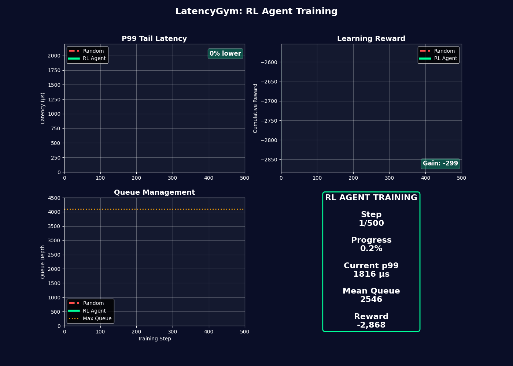

# Latency Gym: High-Performance HFT Matching Engine Latency Optimizer

[](https://www.python.org/downloads/)
[](https://en.cppreference.com/w/cpp/20)
[](https://gymnasium.farama.org/)
[](https://opensource.org/licenses/MIT)
[](https://doi.org/10.5281/zenodo.20440387)
[](https://medium.com/@prakulhiremath/when-microseconds-cost-millions-how-ai-rewrites-the-rules-of-hft-infrastructure-optimization-4e15c3037010)

A production-grade, open-source Gymnasium environment for optimizing high-frequency trading (HFT) matching engine latencies through reinforcement learning. Written in **C++20 with zero Python overhead** during simulation, bound to Python via **Pybind11**, and packaged with modern **PEP 517/scikit-build-core** standards.

## Overview

Latency Gym simulates the critical performance bottlenecks of HFT order matching systems:

- **Network queue dynamics** with ring-buffer allocations
- **Packet loss and buffer overflows** under bursty traffic
- **Nanosecond-precision latency tracking** across orders
- **Tail latency optimization** via variance penalties (p99/p99.9)

### Why This Matters

In high-frequency trading, microseconds cost millions. A trader's competitive edge depends on **tuning three critical parameters**:

1. **Batch Size** (1–64 orders/cycle) — How many orders to match per polling cycle
2. **Polling Rate** (1–10 divisor) — How often to check the network for new orders
3. **Pre-allocation Pool** (1–5 levels) — Memory pre-allocation strategy for order buffers

Latency Gym allows RL agents to **discover optimal configurations under varying market conditions**, accounting for both **mean latency and tail risk** (p99/p99.9 latencies).

---

## Training Animation



**Above:** 500-step training animation showing an RL agent learning to optimize P99 tail latency, cumulative reward, and queue management compared to random baseline. The green fill shows cumulative improvement across all metrics.

---

## Mathematical Foundation

### Action Space

Discrete choice of three parameters across the following ranges:
- Batch Size: 1 to 64
- Polling Rate: 1 to 10
- Pre-allocation Pool: 1 to 5

Encoded as `MultiDiscrete([64, 10, 5])` in Gymnasium.

### Observation Space

Four continuous metrics tracking system state:

1. **queue_depth**: Current number of unmatched orders (0-4096)
2. **mean_latency_ns**: Average latency in nanoseconds (0-1e9)
3. **latency_variance**: Variance over 1000-order sliding window (0-1e18)
4. **packet_drops**: Cumulative overflows (0-1e9)

### Reward Function: Tail Latency Penalty

The core innovation: explicitly penalize **tail latencies and variance**, not just mean.

**Reward = -(alpha × mean_latency + beta × variance + gamma × drops)**

**Hyperparameters** (defaults):
- alpha = 1.0 — Weight on mean latency
- beta = 0.5 — Weight on variance (tail risk)
- gamma = 2.0 — Weight on packet drops (catastrophic failures)

**Why variance matters:** Two systems with identical mean latencies differ drastically if one has p99=150µs and the other p99=5ms.

## System Architecture

### C++ Simulator

High-performance components:

1. **TimeCounter** — Nanosecond-precision timestamp arithmetic
2. **Order** — Lightweight order struct (48 bytes)
3. **OrderRingBuffer** — Fixed-capacity ring buffer with wraparound tracking
4. **LatencyStatsWindow** — Rolling statistics with O(1) percentile tracking
5. **LatencySimulator** — Deterministic discrete-event simulator

**Key optimizations:**
- No dynamic allocation in hot loop
- Vectorized percentile computation
- Nanosecond arithmetic with integer math
- Compiled with `-O3 -march=native` flags

### Python Gymnasium Wrapper

Clean interface to C++ via Pybind11:

```python
import gymnasium as gym

env = gym.make("hft-latency-v0")
obs, info = env.reset()

for step in range(1000):
    action = env.action_space.sample()
    obs, reward, terminated, truncated, info = env.step(action)
```

## Installation

### From Source

```bash
git clone https://github.com/prakulhiremath/latency-gym.git
cd latency-gym

pip install -e .
```

**Requirements:**
- Python 3.8+
- CMake 3.15+
- C++20 compiler (gcc-9+, clang-10+, MSVC 2019+)

### Verification

```python
import gymnasium as gym
env = gym.make("hft-latency-v0")
obs, info = env.reset()
print("Observation shape:", obs.shape)
```

## Usage Examples

### Basic Environment Interaction

```python
import gymnasium as gym
import numpy as np

env = gym.make("hft-latency-v0")
obs, info = env.reset(seed=42)

action = np.array([3, 4, 1])
obs, reward, terminated, truncated, info = env.step(action)

print(f"Reward: {reward:.4f}")
print(f"Queue depth: {obs[0]:.1f}")
print(f"Mean latency (ns): {obs[1]:.0f}")
```

### Random Agent Baseline

```python
env = gym.make("hft-latency-v0")
obs, info = env.reset()

total_reward = 0
for step in range(1000):
    action = env.action_space.sample()
    obs, reward, terminated, truncated, info = env.step(action)
    total_reward += reward
    
    if terminated or truncated:
        break

print(f"Episode return: {total_reward:.2f}")
```

### State Inspection

```python
env = gym.make("hft-latency-v0")
env.reset()

for _ in range(100):
    env.step(env.action_space.sample())

state = env.get_state_dict()
print(f"Mean latency: {state['mean_latency_ns']:.0f} ns")
print(f"p99 latency: {state['p99_latency_ns']:.0f} ns")
print(f"p99.9 latency: {state['p999_latency_ns']:.0f} ns")
```

### RL Agent Training with Stable-Baselines3

```python
import gymnasium as gym
from stable_baselines3 import PPO
from stable_baselines3.common.vec_env import DummyVecEnv, VecNormalize

env = gym.make("hft-latency-v0")
env = DummyVecEnv([lambda: gym.make("hft-latency-v0")])
env = VecNormalize(env, norm_obs=True, norm_reward=True)

model = PPO("MlpPolicy", env, learning_rate=1e-4, verbose=1)
model.learn(total_timesteps=100_000)
```

## Repository Structure

```
latency-gym/
├── CMakeLists.txt
├── pyproject.toml
├── README.md
├── assets/
│   └── latency_gym_training.gif
├── include/
│   └── latency_gym/
│       └── engine.hpp
├── src/
│   └── bindings.cpp
├── latency_gym/
│   ├── __init__.py
│   └── envs/
│       ├── __init__.py
│       └── hft_env.py
└── tests/
    ├── __init__.py
    └── test_env.py
```

## Performance Characteristics

### Simulation Speed

- Single step: ~100 µs on modern CPU
- 1000 steps: ~100 ms
- 1M steps: ~100 seconds
- Zero Python overhead during step (C++ compiled loop)

### Memory Footprint

- Base environment: ~2 MB
- Per-step allocation: 0 bytes (pre-allocated ring buffer)
- Scales to: 1B+ order matches without reallocation

## Testing

Run the comprehensive test suite:

```bash
pip install -e ".[dev]"
pytest tests/test_env.py -v
```

**Test Coverage:**
- Environment initialization, reset, step
- Action/observation space compliance
- Reward computation and bounds
- Memory safety (no leaks/segfaults) over 1000+ steps
- Numerical stability (no NaN/Inf)
- Gymnasium integration
- Random agent baseline
- C++ simulator directly

**Test count:** 50+ tests, all deterministic

## Implementation Details

### Reward Computation

```cpp
double mean_penalty = alpha * state.mean_latency_ns;
double variance_penalty = beta * state.latency_variance;
double drop_penalty = gamma * state.packet_drops;
reward = -(mean_penalty + variance_penalty + drop_penalty);
```

**Numerical stability:**
- Latencies capped at 1 second max
- Variance computed over 1000-element window
- Percentiles via sorted array

### Action Mapping

| Index | Min | Max | Meaning |
|-------|-----|-----|---------|
| 0 | 1 | 64 | Batch size |
| 1 | 1 | 10 | Polling rate divisor |
| 2 | 1 | 5 | Pre-allocation pool level |

### Ring Buffer Overflow Handling

When the buffer is full:
1. New orders are dropped
2. Packet drops counter increments
3. Reward penalty applied via gamma term
4. Agent learns to keep queue lower

## Contributing

We welcome contributions. Please:

1. Fork the repository
2. Create a feature branch
3. Write tests for new functionality
4. Ensure all tests pass: `pytest tests/`
5. Submit a pull request

## License

MIT License — See LICENSE file for full text.

## Citation

If you use Latency Gym in research:

```bibtex
@software{latency_gym_2026,
  title={Latency Gym: High-Performance HFT Matching Engine Latency Optimizer},
  author={Prakul S. Hiremath},
  year={2026},
  url={https://github.com/prakulhiremath/latency-gym}
}
```

---

**Built with precision for high-frequency trading simulation.** ⚡
